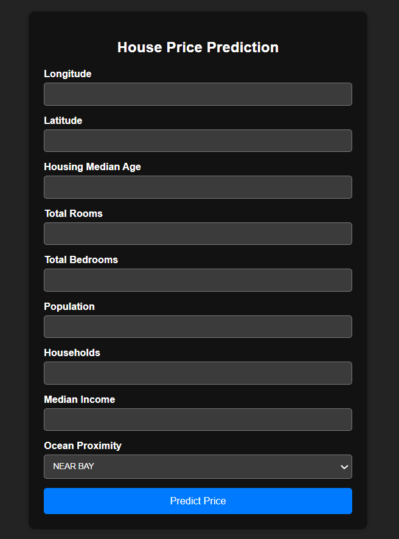
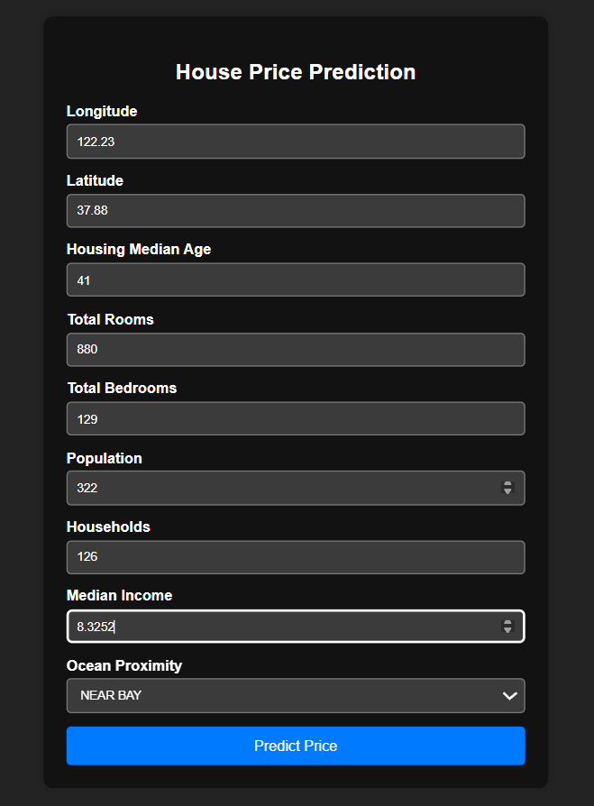
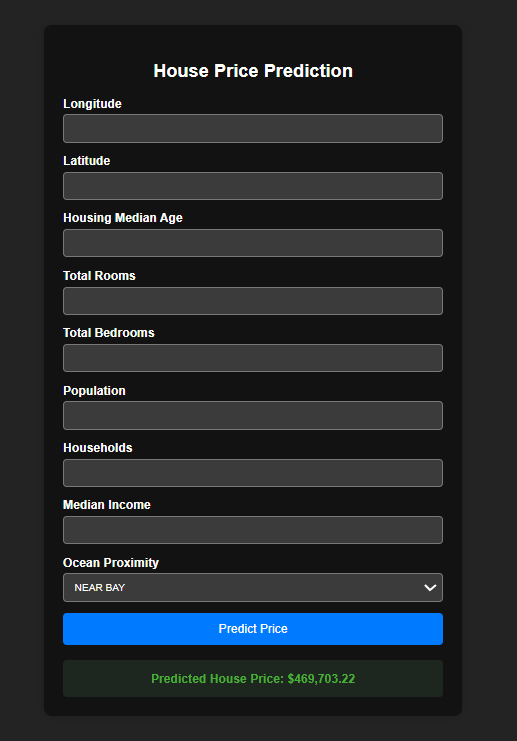

# House Price Prediction System 🏠

A Machine Learning web application that predicts house prices using the California Housing Dataset. The project includes data preprocessing, exploratory data analysis, model training, hyperparameter tuning, and a Flask-based web interface for real-time predictions.

## Installation

Clone the repository and install dependencies:

```bash
git clone https://github.com/Prashantbadgujjar/House_Price_Prediction.git
cd House_Price_Prediction
pip install -r requirements.txt
```

## Usage

Run the Flask application:

```bash
python app.py
```

Open your browser and visit:

```text
http://127.0.0.1:5000
```

Enter the housing details and click **Predict** to get the estimated house price.

## Features

* Data preprocessing using Scikit-learn Pipelines
* Missing value handling and feature encoding
* Feature scaling and transformation
* Hyperparameter tuning using GridSearchCV
* HistGradientBoostingRegressor model
* Flask web application for predictions

## Tech Stack

* Python
* Pandas
* NumPy
* Scikit-learn
* Flask
* Matplotlib
* Seaborn
* Joblib

## Project Structure

```text
House_Price_Prediction/
├── data/
├── models/
├── Notebooks/
├── src/
├── templates/
├── app.py
├── requirements.txt
├── README.md
└── .gitignore
```

## Screenshots

### Home Page



### Input



### Prediction Result




## Future Improvements

* Improved User Interface
* Prediction History Tracking

